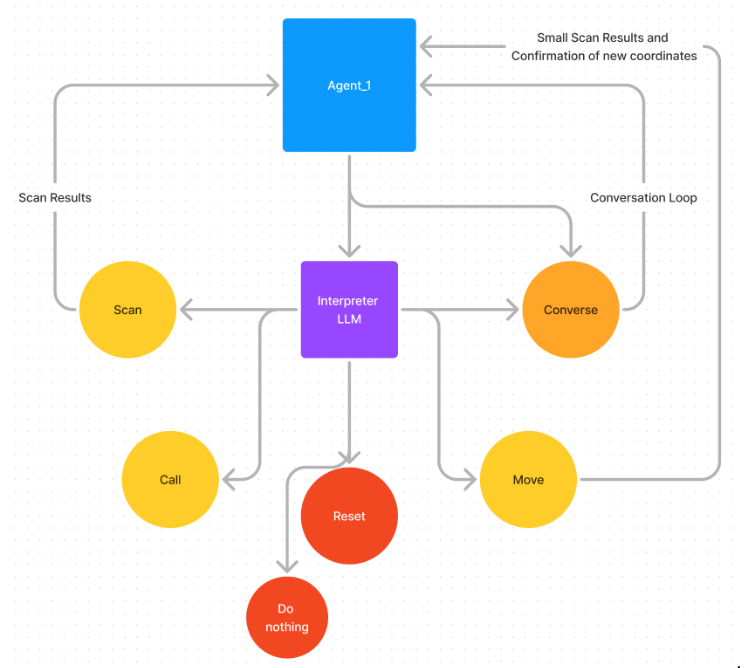

Here’s a detailed README template you can use for your SimuVerse project on GitHub:

---

# SimuVerse

**SimuVerse** is a multi-agent simulation environment powered by large language models (LLMs) integrated into Unity. The project focuses on creating interactive agents that use LLMs to perform tasks such as movement, communication, and tool-based interactions within a 2D grid environment. Each agent can communicate with other agents, interpret responses, and perform various actions such as pathfinding and interacting with tools like `MOVE`. 

The goal of SimuVerse is to create a scalable, research-friendly platform that simulates realistic agent behavior with advanced memory handling mechanisms for long-term interactions.

## Features

- **Multi-Agent Environment**: Agents are represented by LLM instances in Unity. Each agent has unique behaviors powered by LLMs like Ollama and LLaMA 3.
- **Interactive Tools**: Agents can use tools such as `MOVE` to navigate a 2D grid system, powered by pathfinding algorithms.
- **Interpreter System**: A separate interpreter LLM analyzes agent responses and outputs structured commands, determining which tools or actions need to be performed.
- **Memory and Subconscious Agent**: The system includes a memory management framework, where agents access memory to maintain coherent interactions. An optional subconscious agent manages long-term memory retrieval and decision-making.
- **Dynamic Movement**: Agents navigate a grid using pathfinding algorithms, and can interact with predefined areas within a defined coordinate space.
  
## Installation

0. *Download Unity Project File (Includes Scripts)*
   https://drive.google.com/drive/folders/14eSo32BejnApzxn0jZTgM-6BUi1KDfVa?usp=sharing 

2. **Clone the Repository**

   ```bash
   git clone https://github.com/RomanSlack/SimuVerse_V1.git
   cd SimuVerse
   ```

3. **Requirements**

   - Unity (2021.x or later)
   - Ollama and LLaMA models
   - Python (for local LLM setup)
   - .NET 6.0 SDK

4. **Setting Up LLM Instances**

   Make sure you have `ollama.exe` set up and add its path to the Unity `AgentBehavior.cs` script. Each agent can have its own LLM instance with the ability to use different language models.

5. **Install Dependencies**

   Ensure you have all required Unity packages installed. If necessary, install LLaMA 3 or Ollama through their respective repositories and follow the instructions for local deployment.

## How to Run

1. **Open Unity Project**

   Open the project in Unity Hub and load the `SimuVerse` scene. The scene contains the grid system, agents, and the interface for interactions.

2. **Configuring Agents**

   Each agent in SimuVerse is configured in the `AgentBehavior` script and the `Interpreter` script, where you can set different LLM models and parameters. You need to set the model to the ollama.exe models on your device, so for say 3 agents you need to create 4 different ollama.exe files, 3 for the agents and 1 for the interpreter. You need to either go into the properties tab in unity or change the paths in your IDE.

   ```csharp
   public string ollamaPath = "/path/to/ollama.exe";  // Path to your Ollama model
   ```

3. **Start the Simulation**

   Run the project in Unity's Play mode. Agents will spawn and can start interacting with the environment based on their LLM outputs. The interpreter will structure their responses, and the tool system will handle commands like `MOVE`.

## Agent Tools

- **MOVE**: Moves the agent within the grid system using a pathfinding algorithm.
- **Converse**: Agents can communicate with each other through LLM-generated dialogue.
- **Scan**: Analyzes surroundings and responds with the result.
- **Call**: Allows agents to call another agent for help or collaboration.
- **Memory System**: Agents store interactions and use the subconscious agent for long-term memory management.

## Diagrams

### LLM Tools Foundation
<div align="center">
  <h3>LLM Tools Foundation</h3>
  
</div>

### Agent Tools and Scripts
<div align="center">
  <h3>Agent Tools and Scripts</h3>
  
</div>


## Development Roadmap

- **Subconscious Agent**: Expand the subconscious agent for enhanced memory handling and more complex task delegation.
- **Tool Expansion**: Implement additional tools for agents such as `INTERACT`, allowing more diverse behaviors in the environment.
- **3D Environment**: Transition to a 3D space for more realistic simulations and extended agent capabilities.
- **NPC Behavior Framework**: Design a structured system for NPCs to interact dynamically in the simulation.

## Contributing

We welcome contributions from the community! If you're interested in adding new features, fixing bugs, or improving documentation:

1. Fork the repository
2. Create a new branch (`git checkout -b feature-branch`)
3. Commit your changes (`git commit -m 'Add new feature'`)
4. Push to the branch (`git push origin feature-branch`)
5. Open a pull request

## License

This project is licensed under the MIT License - see the [LICENSE](LICENSE) file for details.

## Contact

- **Project Lead**: Roman Slack
- **Email**: romanslack1@gmail.com

---

